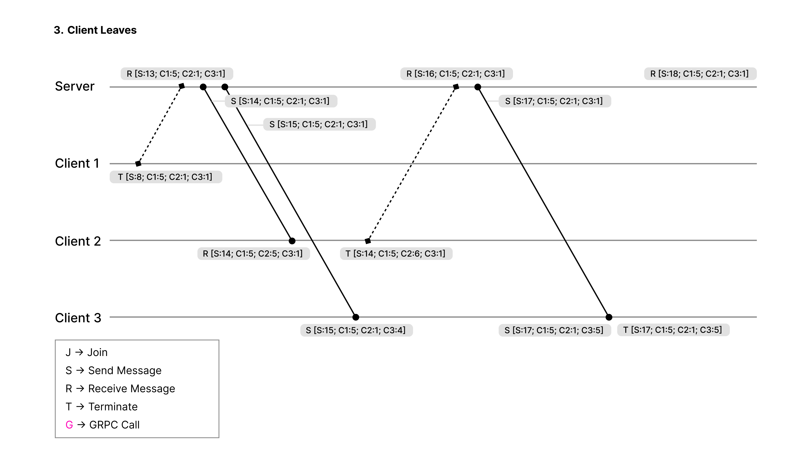

# Chitty chat report

### 2) Discuss, whether you are going to use server-side streaming, client-side streaming, or bidirectional streaming?

In short, we use a mix of both server-side and client-side streaming. These are our two methods:

`JoinChannel():` is server-side streaming, as it receives multiple messages from the server.

`Publish()`: is client-side streaming, as it sends multiple messages to the server and receives a single acknowledgment in response.

If we wanted to use bidirectional streaming, our service would have to be provide the possibility for the server and the client to send and receive messages concurrently. However, our current service only allows clients to join and to send messages but does not offer a simultaneously and bidirectional interaction between server and client(s).

### 3) Describe your system architecture - do you have a server-client architecture, peer-to-peer, or something else?

Our service has two primary components: a server and a client.

**Server component:** Roughly, the server component is responsible for 1) handling clients who wants to join the server via `JoinServer()`, 2) manage the chat channels and 3) facilitate communication between the clients via `Publish()` `broadcast()`.

**Client component:** clients join a certain channel (port) with a certain username (or default ‘User’). In order to be able to communicate with other clients, a client much join the correct channel. After joining, clients can send and receive messages to and from other clients within the same channel.

As described above, our system architecture is server-client architecture made up of the two components, server and client.

### 4) Describe what RPC methods are implemented, of what type, and what messages types are used for communication

**RPC-methods:**

We have chosen to implement two RPC methods: `JoinChannel()` and `Publish()`

`JoinChannel()`: This method is used for a client to join a certain channel. The method type is a server streaming RPC. The request message type is `Channel` (see definition below) and the response message type is Message (see definition below). In short, a client sends a request of type `Channel` and expects to receive a stream of `Message` as a response.

`Publish()`: The method type is client streaming RPC. The request message type is `Message` and the response message type is `MessageAck`. In short, this method is used when a client forwards a `publish()`es a message to the server and the server `broadcast()`s the message to all other clients in the given chat-channel.

**Messages-types for communication.:**

We have defined three different messages:

`Channel`: holds two variables: name (string) and senders_name (string)

`MessageAck`: holds one variables: status

`Message`: holds three variables: Channel (channel), message (string)
and a vector_clock of type map<string, int64>

### 5) Describe how you have implemented the calculation of the Vector Clock timestamps

1. **Initializing the vector**:
   - In both client (**`client.go`**) and server (**`server.go`**), we initialize a **`VectorClock`** as a **`map[string]int64`**. For example, in **`client.go`**:

```go
var clientClock = make(VectorClock)
```

2. **Incrementing the Clock**:
   - **Client Side**: When a client sends or receives a message, we increment the client's own entry in their vector clock. For example:

```go
clientClock[*userName]++ // client
clientClock[*server.name]++ // server
```

- **Server Side**: Similar to the client, we are incrementing in the server's clock every time it sends a message to a client or when it receives a request (join/publish) from it.

3. **Merging Clocks When new message is received**:
   - **On Receiving Messages**: When a message is received, both the client and the server update their vector clocks by taking the maximum value for each entry from their own clock and the received message's clock. The part of the code that handles with this check is the following:

```go
for key, value := range in.VectorClock {
    if clientClock[key] < value {
        clientClock[key] = value
    }
}
```

4. **Usage inside Messages**:
   - The vector clock accompanies each message, allowing receivers to understand the partial ordering of messages based on the vector clock's values.

### 6) Provide a diagram, that traces a sequence of RPC calls together with the Lamport timestamps, that corresponds to a chosen sequence of interactions: Client X joins, Client X Publishes, ..., Client X leaves. Include documentation (system logs) in your appendix.

The three cases Client Joins, Client Publishes and Client Leaves are shown in the three figures below. These can be seen as an overall graph which starts at one (Client Joins) and ends at three (Client Leaves).


Figure 1. Client Joins


Figure 2. Client Publishes



Figure 3. Client Leaves

### 7) Provide a link to a Git repo with your source code in the report

Go to:

[https://github.itu.dk/edtr/distributedsystems/tree/main/3Assignment](https://github.itu.dk/edtr/distributedsystems/tree/main/3Assignment)

### 8) Include system logs, that document the requirements are met, in the appendix of your report

We have chosen to do seperate logs for the server and one for each client [client_1, client_2, client_3].

See the ‘logs’-folder for all logs after running our service.

[https://github.itu.dk/edtr/distributedsystems/tree/main/3Assignment/logs](https://github.itu.dk/edtr/distributedsystems/tree/main/3Assignment/logs)

### 9) Include a readme.md file that describes how to run your program.

See ‘README.md’
